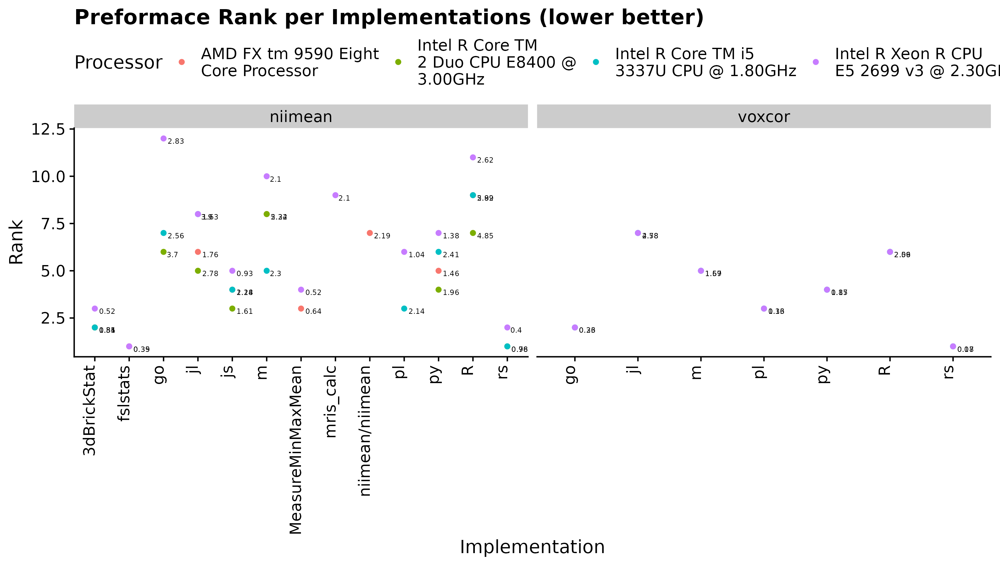

# Rosetta Nii
Various implementations of neuroimaging computation tasks for benchmarking performance and code demonstration.

Currently, only mean and voxel-pairwise correlation of .nii.gz datasets.

Also see https://benchmarksgame-team.pages.debian.net/benchmarksgame/

## Notes

 * Rust and Julia have [Int16 overruns](https://github.com/JuliaNeuroscience/NIfTI.jl/issues/70) that were not obvious. Seen when summing over large nifti image to get mean. Scaling and un-scaling is a fast workaround.
 * Missing implementation
   * I couldn't find a elixir/erlang, php, or ruby nifti libraries
   * common lisps also does not have a ready library, but implementation with `lisp-binary` looks feasible. and using  `april` for APL style math is an interesting prospect.
   * [`patch/`](patch/) adds gzip support to `PDL::IO::Nifti`. **BUG**: does not correctly deal with header offset
   * Java would be interesting but getting a nifti library w/o installing a full IDE was not immediately obvious.

## Results



See hyperfine [`out/*stats.csv`](out/AMD_FX_tm__9590_Eight_Core_Processor-kt-stats.csv) as run by [`Makefile`](Makefile)


### Intel Xeon server

simple mean of 3D image (`wf-mp2rage-7t_2017087.nii.gz`)
<!-- 
cut -d, -f1-2  out/Intel_R__Xeon_R__CPU_E5_2699_v3_@_2.30GHz-rhea.wpic.upmc.edu/niimean-stats.csv|sed 's/ .*,/,/;s:scripts/::'|column -ts, -->
```
command            mean
fslstats           0.35308495769
niimean.rs         0.4606315605666667
3dBrickStat        0.51865660084
MeasureMinMaxMean  0.5215459278600002
niimean.js         0.9318040066400002
niimean.pl         1.0452616458333333
niimean.jl         1.6311526155799996
niimean.py         1.7192550077300002
mris_calc          2.0955282514799993
niimean.m          2.103778385753333
niimean.R          2.6206949904699997
niimean.go         2.829263984946666
```

vs manual loop `voxcor`
<!-- cut -d, -f1-2  out/Intel_R__Xeon_R__CPU_E5_2699_v3_@_2.30GHz-rhea.wpic.upmc.edu/voxcor-stats.csv|sed 's/ .*,/,/'|column -ts, -->
```
command    mean
voxcor.rs  0.10011695514074072
voxcor.go  0.2599205325600001
voxcor.py  1.38515054508
voxcor.m   1.6904066477000002
voxcor.R   2.05836244986
voxcor.jl  2.7809278878133337
```


### Intel i5 laptop
```
3dBrickStat -slow /home/foranw/mybrain/mybrain_2017-08_7t.nii.gz ran
    1.68 ± 0.08 times faster than deno run --allow-read niimean.js
    1.70 ± 0.07 times faster than ./niimean.m
    1.87 ± 0.09 times faster than niimean/niimean
    2.24 ± 0.26 times faster than ./niimean.py
    2.43 ± 0.07 times faster than julia niimean.jl
    4.44 ± 0.12 times faster than ./niimean.R
```

### AMD desktop
```
fslstats wf-mp2rage-7t_2017087.nii.gz -m ran
    1.39 ± 0.01 times faster than 3dBrickStat -slow wf-mp2rage-7t_2017087.nii.gz
    2.93 ± 0.04 times faster than scripts/niimean.m
    2.96 ± 0.05 times faster than deno run --allow-read scripts/niimean.js
    3.75 ± 0.04 times faster than scripts/niimean.py
    4.13 ± 0.06 times faster than julia scripts/niimean.jl
    5.27 ± 0.07 times faster than target/release/niimean
    5.65 ± 0.05 times faster than niimean/niimean
    7.30 ± 0.10 times faster than scripts/niimean.R

```

### Notes
For a simple mean calc, javascript and octave are faster than compile go and rust!

These times are more a measure of an interpreter/VM's startup time. They also demonstrate how much effort the community/library authors have put into optimzing (likely w/ compiled `c` code) hot paths (spm12 in octave, numpy in python).

The rust implementation should be built with `--release`, debug version performance is 10x worse!

Julia's interpreter (1.9.3) startup time is reasonable! It's overall time is on par with python (numpy, not native python).
SIMD "vectorized" operations in python (via numpy) are fast!

R's slow to start.

Javascript is painful to write. Both it and the golang version organize the nifti matrix data as a 1D vector.

Processor makes a differnce in the shootout.


## Run

Run make in shell on a terminal. Optionally set `NRUN` (default 100 runs for each)

```bash
make NRUN=10
```

## Setup

Benchmarking uses [`hyperfine`](https://github.com/sharkdp/hyperfine).

* c
  - `3dBrickstat` is from AFNI
  - `fslstats` is from fsl
* rust
  - `[rustup](https://rustup.rs/) update`
* octave
  1. download spm12 and extract to `~/Downoads/spm12` [`scripts/niimean.m`](scripts/niimean.m) hardcodes addpath 
  1. compile `cd src/ && make PLATFORM=octave install`
* julia
  1. install package in repl like `] add NIfTI` 
* R
  1. `install.packages('oro.nifti')`
* deno
  - `cargo install deno`
  - first run will pull in npm package `nifti-reader-js`

### Debain stable (12.0 "bookworm") in 2023

go (1.19 vs 1.21) and octave (7 vs 8.3) are out of date on debian stable.
To use newer versions on rhea, update the path to include the compile-from-recent-source bin dir:

```
export PATH="/opt/ni_tools/utils/go/bin:$PATH"

# source dl and extracted to /opt/ni_tools/octave-8.3.0-src
# ./configure --prefix=/opt/ni_tools/octave-8.3/ && make install
export PATH="/opt/ni_tools/octave-8.3/bin:$PATH"
```

NB. but use debian backport https://wiki.debian.org/SimpleBackportCreation
## TODO

- [ ] get expert goland and rust advice/implementation (should be faster?)
- [ ] implement various styles (and more complex calculations)
  - [ ] loop vs vector; expect python loop to be especially slow
  - [ ] parallel processing
- [ ] preform within interpreter time benchmarking (remove startup costs)
- [ ] containerize benchmarks
- [ ] other implementations
  - [ ] julia's APL implementation
  - [ ] fix perl's `PDL::IO::Nifti` to work with compresssed images (remove extra seek)
  - [ ] common lisp or guile version (ffi w/ niftilib)
  - [ ] [compile julia](https://docs.juliahub.com/PackageCompiler/MMV8C/1.2.1/devdocs/binaries_part_2.html)
